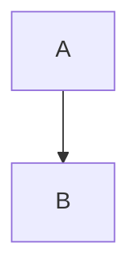

本教程用于说明一套**基于博客/文档系统的扩展 Markdown 编写规范**。这些规范在标准 Markdown 基础上，引入了 **Front Matter 元信息、内容控制、扩展语法组件** 等能力，适用于如 Astro / 静态博客 / 内容管理系统。

---

## 一、文档通用结构规范

所有文章类 Markdown 文件，**推荐统一结构如下**：

```markdown
---
# Front Matter 区（YAML）
---

# 正文标题

正文内容……
```

说明：

- `---` 包裹的部分称为 **Front Matter（前言元数据）**
    
- Front Matter 使用 **YAML 语法**
    
- 正文部分为标准 Markdown + 扩展语法
    

---

## 二、Front Matter（前言元数据）规范

### 1. 常用字段总览

```yaml
---
title: 文章标题
published: 2024-01-15
description: 简要描述
tags: [Tag1, Tag2]
category: 分类名
draft: false
pinned: false
---
```

### 2. 字段说明表

|字段名|说明|
|---|---|
|title|文章标题|
|published|发布时间（支持日期或 ISO 时间）|
|updated|更新时间|
|description|首页/列表摘要|
|tags|标签数组|
|category|分类|
|draft|是否为草稿（true 不显示）|
|pinned|是否置顶|
|image|封面图路径|
|alias|自定义访问路径|
|author|作者|
|licenseName|许可证|
|sourceLink|原文或参考链接|

---

## 三、特殊文章类型模板

### 1. 草稿文章（Draft）

```yaml
---
title: Draft Example
published: 2024-01-11
draft: true
---
```

规则：

- `draft: true` 的文章不会被公开渲染
    
- 发布时改为 `false`
    

---

### 2. 加密文章（Encrypted Post）

```yaml
---
title: Encrypted Post
encrypted: true
password: "123456"
pinned: true
alias: encrypted-example
---
```

规则：

- `encrypted: true` 启用加密
    
- `password` 为访问密码
    
- 内容在前端解密后渲染
    

---

## 四、扩展 Markdown 语法

### 1. GitHub 仓库卡片

```markdown
::github{repo="用户名/仓库名"}
```

用途：

- 动态展示 GitHub 仓库信息
    

---

### 2. 提示块（Admonitions）

支持类型：

- note
    
- tip
    
- important
    
- warning
    
- caution
    

#### 基础写法

```markdown
:::note
这是提示内容
:::
```

#### 自定义标题

```markdown
:::tip[自定义标题]
内容
:::
```

#### GitHub 风格写法（兼容）

```markdown
> [!TIP]
> 提示内容
```

---

### 3. Spoiler（折叠/隐藏内容）

```markdown
这是 :spoiler[隐藏的内容]
```

---

## 五、Mermaid 图表支持

使用 fenced code block + `mermaid` 标识。

### 示例：流程图



支持类型：

- Flowchart
    
- Sequence Diagram
    
- Gantt
    
- Class Diagram
    
- State Diagram
    
- Pie Chart
    

---

## 六、视频嵌入规范

### 通用规则

- 直接在 Markdown 中写 **HTML iframe**
    
- 不需要额外语法
    

### YouTube 示例

```html
<iframe width="100%" height="468" src="https://www.youtube.com/embed/视频ID" allowfullscreen></iframe>
```

### Bilibili 示例

```html
<iframe width="100%" height="468" src="//player.bilibili.com/player.html?bvid=BVxxxx" allowfullscreen></iframe>
```

---

## 七、文件组织规范（推荐）

```text
src/content/posts/
├── post.md
└── post-name/
    ├── index.md
    └── cover.png
```

说明：

- 支持单文件或目录结构
    
- 资源文件与文章同目录
    

---

## 八、最佳实践建议

- Front Matter 字段保持统一、简洁
    
- 标签与分类避免滥用
    
- alias 使用小写 + 中划线
    
- Mermaid 图用于逻辑表达，不宜过度
    
- 视频嵌入注意移动端比例
    

---
